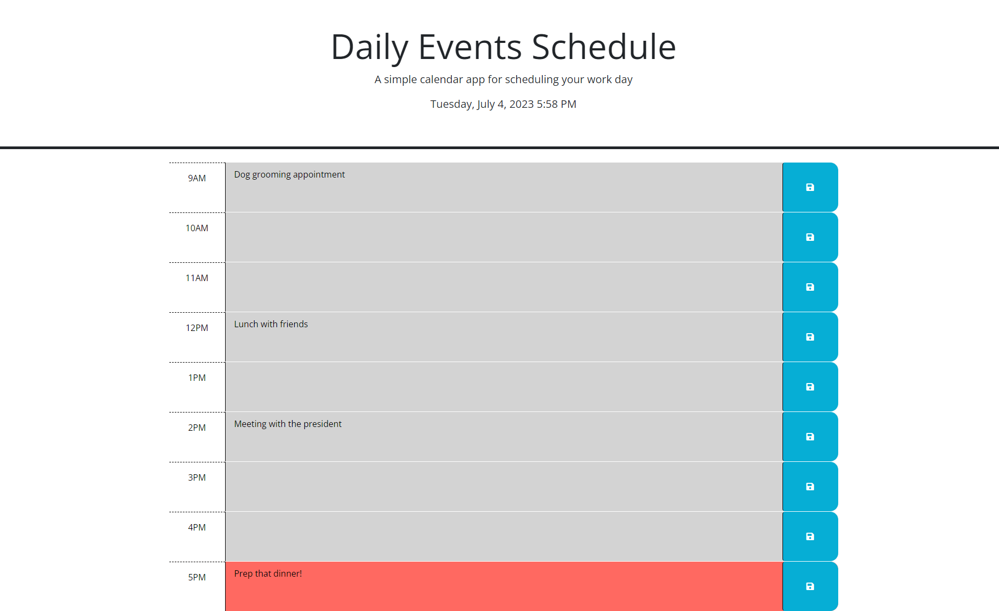

# Daily-Events-Schedule

## Description

- This application is meant to assist in your daily meetings scheduling for work.
- It covers a 9-5 schedule.
- The meeting information is saved into localStorage.
- The time-blocks on the scheduler will inform you of hours past (grey), hour present (red), hours future (green).

## Link to Live Application

https://mhammy.github.io/daily-events-schedule/

## Usage

Type your desired description in the text-area, then click the save button.
Upon reloading or returning to your schedule, your saved meetings will re-populate.
The color coded hours display past (grey), present(red) and future(green) listings based on your local time.

## Credits

I am not the original creator of the CSS and HTML used on the application, only the Javascript. 
The .css and .html files are slightly modified versions of the original files given to me by the MSU Bootcamp curriculum.

https://api.jquery.com

https://day.js.org/docs/en/display/format

## License

Please refer to the License in the repository.